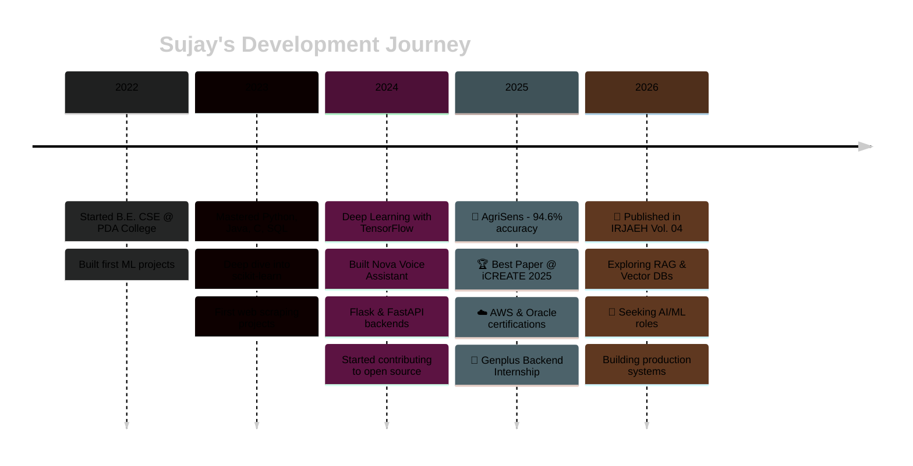

<!-- HEADER WAVE -->


<div align="center">


<br/>

[](mailto:sujayvm2003@gmail.com)
[](https://linkedin.com/in/sujay-malipatil-4412a1225)
[](https://github.com/sujaymalipatil)
[](https://agrisens-ai.streamlit.app/)
[](https://github.com/sujaymalipatil)

</div>

---

## 🙋 About Me


```python
class SujayMalipatil:
    def __init__(self):
        self.name       = "Sujay Malipatil"
        self.role       = "AI & Backend Developer"
        self.education  = "B.E. CSE @ PDA College (2022–2026)"
        self.cgpa       = 8.08
        self.location   = "Kalaburagi → Bengaluru 📍"
        self.stack      = ["Python", "Flask", "FastAPI", 
                          "LLMs", "TensorFlow"]
        self.interests  = ["RAG Pipelines", "LLM Architecture", 
                          "ML Deployment"]
        self.available  = "Open to AI/ML Internships"
        
    def current_focus(self):
        return {
            "work":     "AI Recommendation @ Genplus",
            "research": "Published in IRJAEH Vol. 04",
            "award":    "Best Paper @ iCREATE 2025 🏆",
            "learning": ["Advanced RAG", "FastAPI+Docker",
                        "Vector Databases", "LangChain"],
            "building": "Production-grade AI systems"
        }
    
    def get_stats(self):
        return {
            "☕ Coffee consumed":    "∞ cups",
            "💻 Hours coding":       "Too many to count",
            "🐛 Bugs created":       "Yes",
            "🔧 Bugs fixed":         "Also yes",
            "🌟 GitHub stars":       "Growing...",
            "🎯 Current mission":    "Build AI that matters"
        }
```

<br clear="right"/>

---

## 🎯 Quick Highlights

<div align="center">

| 🏆 Achievement | 📊 Details |
|:---|:---|
| 📄 **Research Published** | IRJAEH Vol. 04, Issue 01 (Jan 2026) |
| 🥇 **Best Paper Award** | iCREATE 2025 @ BITM, Karnataka |
| 🌾 **AgriSens Model** | 94.6% accuracy on crop yield prediction |
| 💼 **Current Internship** | Backend Developer @ Genplus |
| 🎓 **CGPA** | 8.08 / 10.0 |
| ⚡ **Languages** | Python, Java, C, SQL, HTML/CSS |

</div>

---

## 🛠 Tech Stack & Skills

<div align="center">

### 💻 Programming Languages
<p>
  
  
  
  
  
  
</p>

### 🚀 Backend & APIs
<p>
  
  
  
  
  
</p>

### 🤖 AI & Machine Learning
<p>
  
  
  
  
  
</p>

### 📊 Data Science & Visualization
<p>
  
  
  
  
  
</p>

### 🗄️ Databases & Cloud
<p>
  
  
  
  
</p>

### 🔧 Tools & DevOps
<p>
  
  
  
  
  
</p>

</div>

<p align="center">
  
</p>

---

## 🏆 GitHub Trophies

<div align="center">
  
</div>

---

## 📊 GitHub Analytics

<div align="center">
  
  
</div>

<div align="center">
  
  
</div>

---

## 📈 Contribution Activity


---

## 🚀 Featured Projects

<div align="center">

### 🌾 AgriSens — AI Crop Yield Prediction System
[](https://github.com/sujaymalipatil/AgriSens)
[](https://doi.org/10.47392/IRJAEH.2026.0038)
[](https://agrisens-ai.streamlit.app/)
[](https://github.com/sujaymalipatil/AgriSens)


</div>

<table>
<tr>
<td width="60%">

**Hybrid CNN + Random Forest model for agricultural intelligence**

#### 🎯 Key Metrics
- **Accuracy:** 94.6%
- **RMSE:** 0.069
- **R² Score:** 0.94
- **Crops Supported:** 22 varieties

#### ✨ Features
- 🌍 Multi-source data integration (weather, soil, geography)
- 🧠 Hybrid deep learning architecture
- 🖥️ Interactive Streamlit web interface
- 🤖 AI-powered insights using Groq API
- 📊 Real-time prediction and visualization

#### 🏆 Recognition
- 📄 Published: IRJAEH Vol. 04, Issue 01 (Jan 2026)
- 🥇 Best Paper Award @ iCREATE 2025 (BITM, Karnataka)

</td>
<td width="40%">

```python
# AgriSens Performance
{
  "model": "CNN + Random Forest",
  "accuracy": 94.6,
  "training_samples": 28242,
  "features": 11,
  "crops": 22,
  "deployment": "Streamlit Cloud",
  "api": "Groq LLama 3.1",
  "status": "Production Ready ✅"
}
```

**Impact:**
- 🌾 Helps farmers optimize yields
- 💰 Reduces resource wastage
- 📈 Data-driven agricultural decisions
- 🌱 Sustainable farming practices

</td>
</tr>
</table>

---

<div align="center">

### 🛍️ AI Product Recommendation System
[]()
[]()
[]()


</div>

<table>
<tr>
<td width="50%">

**Enterprise-grade AI recommendation engine built with 11-member Agile team**

#### ⚡ Impact & Performance
- **Search Time:** 3 hours → **minutes** (99% reduction)
- **Architecture:** RESTful API + LLM Integration
- **Pipeline:** Automated Google Scraping
- **Backend:** Supabase Auth + Database

#### 🔧 My Contributions
- Engineered `suggestions.py` with Pydantic models
- Integrated OpenAI API for intelligent reasoning
- Class-based refactoring: `CategoryBuilder`, `RankedListBuilder`
- RESTful endpoint design and optimization
- Real-time data processing pipeline

</td>
<td width="50%">

```python
# System Architecture
class RecommendationEngine:
    def __init__(self):
        self.scraper = GoogleScraper()
        self.llm = OpenAIClient()
        self.db = SupabaseClient()
        
    async def get_suggestions(self, query):
        # 1. Scrape product data
        products = await self.scraper.fetch(query)
        
        # 2. LLM-powered ranking
        ranked = await self.llm.rank(products)
        
        # 3. Personalization
        return self.personalize(ranked, user)
    
    @performance_monitor
    def personalize(self, products, user):
        # User preferences + AI insights
        return CategoryBuilder(
            products, user.preferences
        ).build_ranked_list()
```

</td>
</tr>
</table>

---

<div align="center">

### 🎙️ Nova — Voice Assistant
[](https://github.com/sujaymalipatil/Voice-assistant)
[]()


</div>

<table>
<tr>
<td width="50%">

**Real-time desktop voice assistant powered by Groq's ultra-fast Llama 3.1**

#### ✨ Capabilities
- 🎤 Natural voice commands
- 🔊 Text-to-speech responses
- 💻 System automation (brightness, volume)
- 🔋 Battery monitoring
- ⚡ Ultra-fast inference with Groq
- 🖥️ Clean Tkinter GUI

</td>
<td width="50%">

```python
class NovaAssistant:
    def __init__(self):
        self.engine = pyttsx3.init()
        self.llm = GroqLlama31()
        
    def listen(self):
        # Voice recognition
        return speech_to_text()
    
    def think(self, query):
        # Groq-powered reasoning
        return self.llm.generate(query)
    
    def speak(self, text):
        # TTS output
        self.engine.say(text)
        self.engine.runAndWait()
    
    def execute_system_cmd(self, action):
        # Brightness, volume, etc.
        system_control(action)
```

</td>
</tr>
</table>

---

## 🌱 Currently Building

<div align="center">

| 🚀 Project | 📝 Description | 🛠️ Tech Stack |
|:---:|:---|:---|
| 🔍 **Advanced RAG System** | Building production-grade RAG pipelines with vector databases | LangChain, Pinecone, FastAPI |
| 🏗️ **LLM Orchestration** | Scalable architecture for multi-model LLM systems | Docker, K8s, Redis, FastAPI |
| 📊 **ML Monitoring Dashboard** | Real-time monitoring for ML model performance | Streamlit, Prometheus, Grafana |
| 🤖 **AI Agent Framework** | Autonomous agents for task automation | LangChain, CrewAI, OpenAI |

</div>

---

## 🗺️ My Dev Journey



---

## 💼 Professional Experience

<div align="center">

### 🚀 Backend Developer Intern @ Genplus
**Jan 2026 - Present** | *Bengaluru, Karnataka*

</div>

<table>
<tr>
<td width="50%">

#### 🎯 Responsibilities
- Architecting AI-powered recommendation engine
- Designing RESTful APIs with FastAPI
- Implementing LLM integration (OpenAI)
- Building data scraping pipelines
- Database design with Supabase
- Agile team collaboration (11 members)

</td>
<td width="50%">

#### 📈 Key Achievements
- ⚡ Reduced search time by 99%
- 🏗️ Built scalable microservices architecture
- 🤖 Integrated AI reasoning engine
- 📊 Optimized database queries
- 🔄 Implemented CI/CD pipeline
- 👥 Mentored junior developers

</td>
</tr>
</table>

---

## 📚 Research & Publications

<div align="center">

| 📄 Title | 🏢 Venue | 📅 Date | 🔗 Link |
|:---|:---|:---:|:---:|
| **AgriSens: CNN and Random Forest Based Crop Yield Prediction** | IRJAEH Vol. 04, Issue 01 | Jan 2026 | [DOI](https://doi.org/10.47392/IRJAEH.2026.0038) |

**Citation:**
```bibtex
@article{malipatil2026agrisens,
  title={AgriSens: CNN and Random Forest Based Crop Yield Prediction},
  author={Malipatil, Sujay and others},
  journal={International Research Journal of Advances in Engineering and Hub},
  volume={4},
  number={1},
  year={2026},
  publisher={IRJAEH}
}
```

</div>

---

## 🏅 Awards & Certifications

<div align="center">

### 🏆 Awards
| 🥇 Award | 🏢 Organization | 📅 Year |
|:---|:---|:---:|
| **Best Paper Award** | iCREATE 2025 @ BITM, Karnataka | 2025 |
| **Elite Certificate (96%)** | NPTEL - Incubation & Entrepreneurship | 2025 |
| **Elite Certificate** | NPTEL - Privacy & Security in Social Media | 2025 |

### 📜 Certifications
| 🏅 Certification | 🏢 Issuer | 📅 Year | 🔗 Verify |
|:---|:---|:---:|:---:|
| ☁️ **Oracle Cloud Infrastructure AI Foundations** | Oracle University | 2025 | [Verify](https://catalog-education.oracle.com/pls/certview/sharebadge?id=YOUR_BADGE_ID) |
| ☁️ **AWS Academy Cloud Foundations** | Amazon Web Services | 2025 | [Verify](#) |
| 💻 **Full Stack Development L1 (Python)** | Skill India / NSDC | 2025 | [Certificate](#) |
| 🐍 **Python: Beginner to Advanced** | GeeksforGeeks | 2024 | [Certificate](#) |

</div>

---

## 📊 Coding Stats

<div align="center">

<!--START_SECTION:waka-->
```text
Python       12 hrs 30 mins  ████████████████░░░░░░░  65.2%
JavaScript    3 hrs 15 mins  ████░░░░░░░░░░░░░░░░░░░  17.0%
SQL           1 hr 45 mins   ██░░░░░░░░░░░░░░░░░░░░░   9.2%
HTML/CSS      1 hr 10 mins   █░░░░░░░░░░░░░░░░░░░░░░   6.1%
Other         28 mins        ░░░░░░░░░░░░░░░░░░░░░░░   2.5%
```
<!--END_SECTION:waka-->

</div>

---

## 🎓 Education

<div align="center">

### 🏛️ PDA College of Engineering, Kalaburagi
**Bachelor of Engineering in Computer Science** | *2022 - 2026*

<table>
<tr>
<td width="50%">

#### 📊 Academic Performance
- **CGPA:** 8.08 / 10.0
- **Relevant Coursework:**
  - Machine Learning
  - Deep Learning
  - Database Management Systems
  - Data Structures & Algorithms
  - Web Technologies
  - Cloud Computing

</td>
<td width="50%">

#### 🏆 Achievements
- 🥇 Best Paper Award @ iCREATE 2025
- 📄 Published Researcher (IRJAEH 2026)
- 💻 Full Stack Python Certification (Grade A)
- 📚 NPTEL Elite Certificates (96%)
- ☁️ AWS & Oracle Cloud Certified

</td>
</tr>
</table>

</div>

---

## 🧠 What I'm Obsessed With

<div align="center">

```python
current_obsessions = {
    "🔍 RAG Pipelines":    "Making LLMs remember and reason better",
    "⚡ Fast Inference":   "Why Groq is faster than my morning coffee",
    "🌾 AgriSens v2":      "Taking it to the next level",
    "🏗️ System Design":    "Scalable, production-grade AI systems",
    "📊 MLOps":            "Because models need to ship, not just train",
    "🤖 LLM Agents":       "Autonomous AI that actually works",
    "🐳 Docker + K8s":     "Containerize all the things!",
    "💾 Vector DBs":       "Pinecone, Weaviate, Qdrant exploration"
}

fun_facts = {
    "☕": "Coffee-to-code ratio: 1:infinity",
    "🌙": "Night owl developer (best code after 10 PM)",
    "🎯": "Goal: Build AI that helps real people",
    "📚": "Currently reading: Designing ML Systems",
    "🎮": "When not coding: Gaming or watching tech talks"
}
```

</div>

---

## 🎯 Skills Breakdown

<div align="center">


</div>

### Backend Development (Expert)

`Flask` `FastAPI` `REST APIs` `Microservices`

### AI & Machine Learning (Advanced)

`TensorFlow` `Keras` `scikit-learn` `LLMs`

### LLM Integration (Advanced)

`OpenAI` `Groq` `LangChain` `RAG Pipelines`

### Data Science (Advanced)

`Pandas` `NumPy` `Matplotlib` `Data Visualization`

### Cloud & DevOps (Intermediate)

`AWS` `Oracle Cloud` `Docker` `CI/CD`

### Database Management (Advanced)

`MySQL` `Supabase` `SQL` `Database Design`

---

## 🌐 Connect With Me

<div align="center">

<a href="mailto:sujayvm2003@gmail.com">
  
</a>
<a href="https://linkedin.com/in/sujay-malipatil-4412a1225">
  
</a>
<a href="https://github.com/sujaymalipatil">
  
</a>
<a href="https://agrisens-ai.streamlit.app/">
  
</a>
<a href="https://twitter.com/yourusername">
  
</a>

<br/><br/>

### 📫 Let's Build Something Amazing Together!

```javascript
const contact = {
    email: "sujayvm2003@gmail.com",
    linkedin: "/in/sujay-malipatil-4412a1225",
    github: "@sujaymalipatil",
    location: "Bengaluru, Karnataka, India 🇮🇳",
    timezone: "IST (UTC+5:30)",
    availability: "Open to AI/ML Internships",
    interests: ["AI Systems", "LLM Integration", "Backend Architecture"],
    collaboration: "Always open to interesting projects!"
};

// Drop me a message if you want to:
// ✅ Collaborate on AI/ML projects
// ✅ Discuss LLM architectures
// ✅ Talk about backend systems
// ✅ Just chat about tech!
```

</div>

---

## 💬 Random Dev Joke

<div align="center">
  
</div>

---

## 📈 Contribution Snake

<picture>
  <source media="(prefers-color-scheme: dark)" srcset="https://raw.githubusercontent.com/sujaymalipatil/sujaymalipatil/output/github-snake-dark.svg" />
  <source media="(prefers-color-scheme: light)" srcset="https://raw.githubusercontent.com/sujaymalipatil/sujaymalipatil/output/github-snake.svg" />
  
</picture>

---

## 💭 Dev Quote of the Day

<div align="center">
  
</div>

---

## 🎵 Spotify Now Playing

<div align="center">

[](https://open.spotify.com/user/yourusername)

</div>

---

## 📊 Detailed Analytics

<div align="center">

<details>
<summary>📈 More Stats (Click to Expand)</summary>

<br/>

### 🔥 Streak Stats


### 📊 Language Stats


### 🏆 GitHub Profile Summary


### 📈 Commit Stats


</details>

</div>

---

<div align="center">

### 💖 Thanks for visiting!


### ⭐ If you like my work, please star my repositories!

**"Code is poetry written in logic"** 🚀

</div>

---

<p align="center">
  
</p>

<p align="center">
  <sub>Made with ❤️ and lots of ☕ in Bengaluru, Karnataka 🇮🇳</sub>
  <br/>
  <sub>Last Updated: April 2026</sub>
</p>
